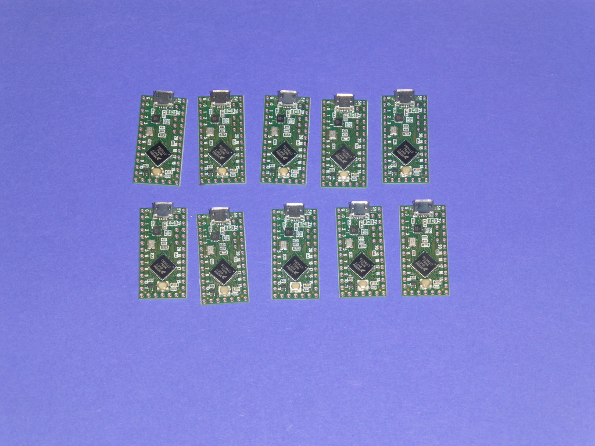
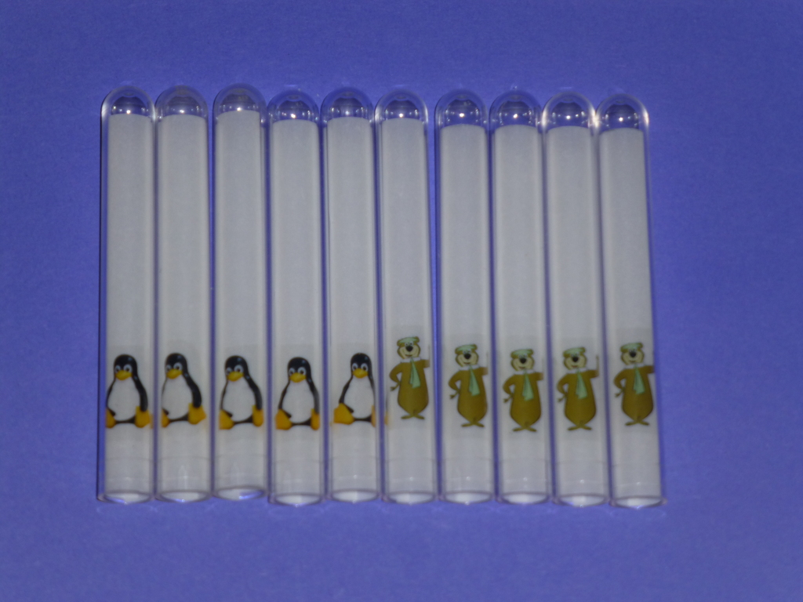
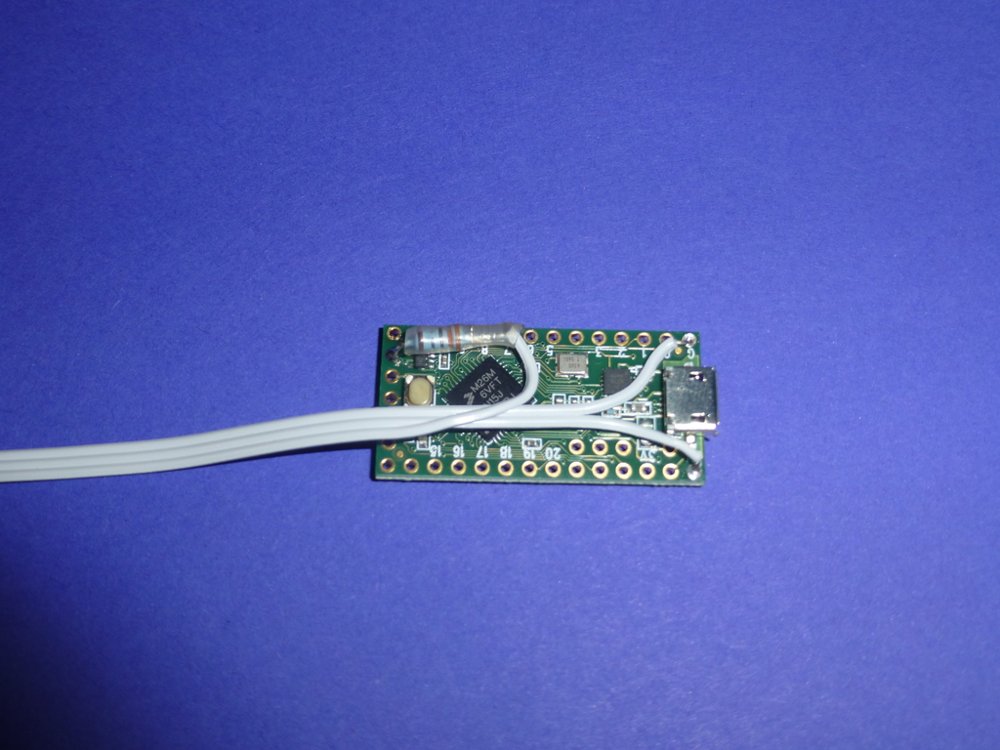
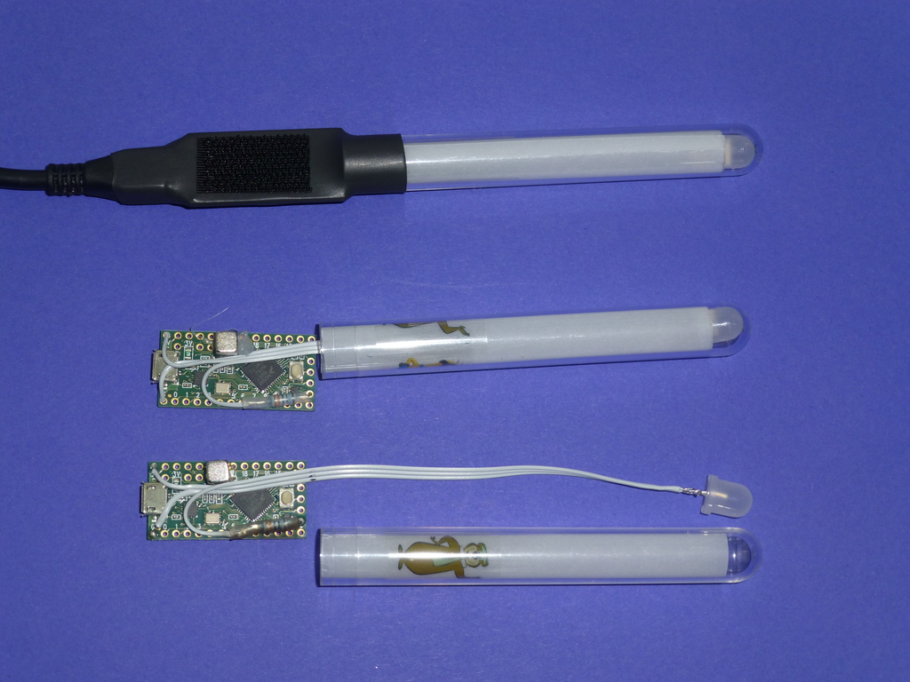
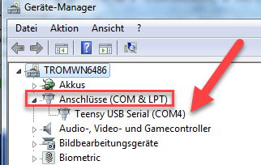
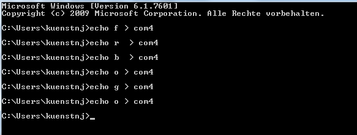
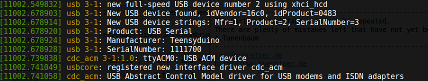

# Teensy-RGB-LED
A simple Teensy-Programm (written as Arduino-Sketch!) to control a WS2812-RGB-Led

## Introduction
This is a very simple Arduino-Sketch for the Teensy - LC with the aim to control a WS2812-RGB-Led from a
host-computer through a connected Teensy-LC via USB-Serial

## Preconditions
You need
- Arduino Programming-Environment
- The Teensy-LC-Libraries as provided by PJRC on: https://www.pjrc.com/teensy/teensyLC.html
- for sure: a Teensy LC. We have choosen the Teensy LC for two reasons:
  - it already has a USB-Serial-Converter on board
  - it already has a HW-driver for the WS2812-Stripes on Pin 17 built in
- a Adafruit Neopixel WS2812 RGB - LED and (as recommended) a 330 Ohm-Resistor

## Wiring
Wiring is rather simple:

```
  Teensy LC +5 V   ------------------ LED +5v
  Teensy LC GND    -------------------LED GND
  Teensy LC Pin 17 ----- 330 Ohm ---- LED Data In
```
## Usage
Just send a simple char via your host-PC to the serial port (on Linux-Machines, if you installed everything correctly a Teensy will show up on /dev/ttyACM0.
On a Linux-Machine you can simply echo to that device, eg: `echo 'r' > /dev/ttyACM0`
Accepted Characters:
- r => red
- g => green
- b => blue
- p => pink
- t => turquoise
- y => yellow
- w => white
- o => off
- i => idle, thats a rainbow

New "Colors" as of 2016-03-13:

- f => flashing
- n => no-flashing


## Usage in "real life"
We recently built 10 of these Teensy-RGB-LEDs (Photos will follow...) and we intend to use the Teensy-RGB-LED for the following purposes
- Show the status of a Test-PC in our Test-Farm
- Use the LED as a Pomodoro-Status for everyone in the team, for the Pomodor-Technique see here:  https://en.wikipedia.org/wiki/Pomodoro_Technique (or even as a simple "Do-Not-Disturb-Now"-Indicator)
- Use it as Wait/Ready - Indicator in Trainings : We currently are holding trainings on computers. With some networking scripts the trainer can set ALL Teensy-RGB-LEDs at all trainees-PCs e.g. to Red. The Trainee can then - when he is finished with his task at his PC - set the LED to Green. The trainer then has an easy control about the status of all trainees.<br>The necessary software for this setup on the different PCs (we have a master-PC, thats the one of the Trainer and we have Minion-PC, that are the trainee-PCs) is done by Eric Keller, see here : https://github.com/erickeller/project-led.git

## Single LED Example
This is how we built our 10 single LEDs:

 10 times Teensy :
 

 10 times already prpepared tubes :
 

 Teensy Detail :
 

 The final solution :
 

## Controlling the LED from a PC

As stated above, controlling the RGB-LED is rather easy.
"Main problem" is to find out about the used serial-port on your PC.

### Solution for Windows

when plugging in the Teensy for the first time, you should see something similar to this in your windows:  
(Sorry, currently only have a german Windows-Installation available)  


In case you missed that you have to ask your Device-Manager in the System-Settings:  


Try out if that works in the CMD-Shell (ALT-F2 cmd):  


If that works: Use the examples in the examples-folder, adapt them to your needs and place a link to the appropriate Batch-File to your desktop.

### Solution for Linux

after plugging in you teensy call ____dmesg____ and you should see something like this:  


Now you echo the wanted color to the repsective device,  
e.g. ____echo b > /dev/ttyACM0____  
and put this into a shell-script.


