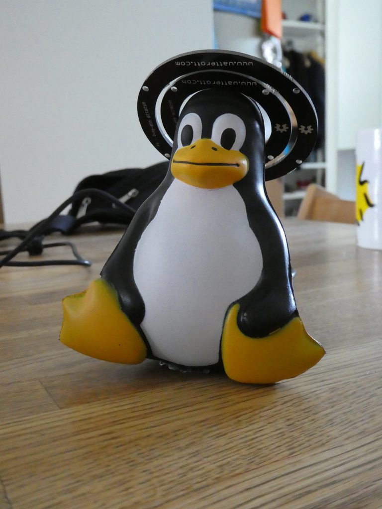
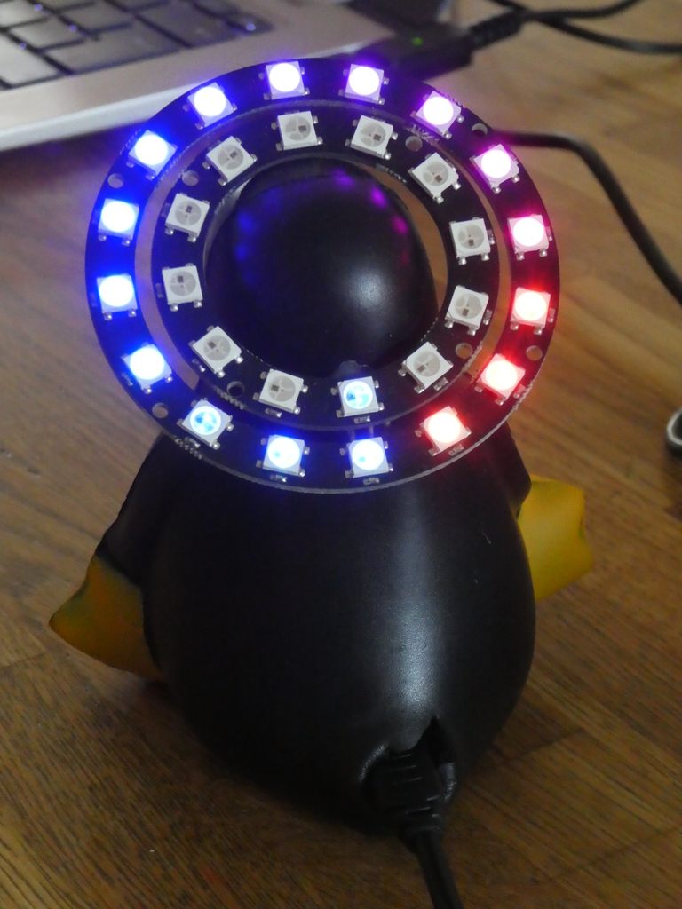

# Teensy-LED-Stripe
A simple Teensy-Programm (written as Arduino-Sketch!) to control a WS2812-RGB-Led-Stripe

## Introduction
This is an extension of the Teensy-RGB-LED (see parent-directory)
For all details see there, here I will only explain about the differences

```
## Usage
In addition single LEDs can be controlled, precede the color with the number of the LED, seperated by a colon.
- e.g. "2:g" will set LED Nr 2 (counting from 0) to green
- e.g. "3:f" will set LED Nr 3 (counting from 0) to fashing with the current color

Sending a new color will always stop flashing (for the affected LED)

In additon you can also send the "number" a for all LEDs.
This means you can either send "a:r" or "r" to set all LEDs to red.


## Usage in "real life"
I built a double ring and put it onto the head of a plastic-rubber Tux.
The teensy is put inside the Tux.
It slightly reminds me of Richard M. Stallman with the gloriole...
I use this to show the status of our CI, especially the automated tests of the components which partly need to built and tested on top of each other.
When a component fails to build/test the corresponding LED is red, when everything is fine it is green.
Depending on the independance of the component either there is one single red LED or the rest of the ring gets red...


## LED-Stripe Example

The Tux with gloriole :
 

The Teensy hidden in the bottom, the cable coming out from the bottom :
 

 Tux in Action :
 

 

